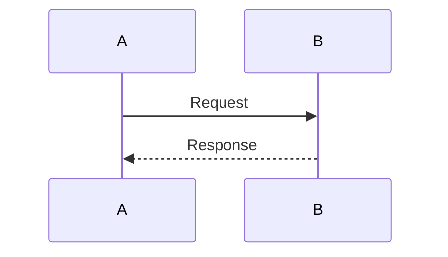

# ReDoc PRD - Product Requirements Document

**Version:** 1.0  
**Date:** December 2024  
**Author:** Julio / Claude Analysis  
**Status:** Ready for Development

---

## Executive Summary

ReDoc is a CLI tool that captures developer knowledge at the moment of pushing code. Instead of generating automated documentation, it asks contextual questions and records the developer's reasoning—the "brain dump" that usually gets lost.

**Core Philosophy:** 5 minutes of capture beats 30 minutes of formal documentation. Free forever, no enterprise bloat.

---

## Problem Statement

Documentation problems in development teams:

1. **Automated docs are shallow** - Tools like JSDoc capture WHAT, never WHY
2. **Manual docs are skipped** - ADRs are too formal, devs skip them
3. **Context gets lost** - 6 months later, no one knows why decisions were made
4. **Wrong timing** - Documentation happens too late (or never)

**ReDoc's insight:** The best time to capture reasoning is at push time, when the context is fresh.

---

## Product Vision

A CLI that:
- Triggers on `git push` (via hooks)
- Analyzes the diff to understand what changed
- Asks 2-4 smart questions about WHY
- Accepts rich answers (text, code, diagrams)
- Generates a structured document
- Stores it with the code (submodule)

**Non-goals:**
- Web dashboard
- Team collaboration features
- Analytics/metrics
- Enterprise pricing
- Complex integrations

---

## Competitive Landscape

### Category 1: Auto-Documentation

| Tool | Price | Weakness |
|------|-------|----------|
| Swimm | $390/mo | Complex, enterprise-focused |
| Mintlify | $150/mo+ | Static docs, not decisions |
| DocuWriter.ai | Credits | No workflow integration |

### Category 2: ADR Tools

| Tool | Stars | Weakness |
|------|-------|----------|
| adr-tools | 4K+ | Manual, separate from workflow |
| MADR | 3K+ | Template-heavy, bureaucratic |
| Log4brains | 1K+ | Requires discipline |

### Category 3: Changelog/Release

| Tool | Stars | Weakness |
|------|-------|----------|
| git-cliff | 9K+ | Commit messages only |
| semantic-release | 20K+ | No decision context |

**ReDoc's unique position:** ONLY tool that captures knowledge via AI-generated contextual questions at commit time.

---

## Technical Requirements

### TR-1: Multi-Provider AI Support

**Requirement:** Support multiple free AI providers with automatic fallback.

**Supported Providers (all free tier):**

| Provider | Model | Limits | Speed |
|----------|-------|--------|-------|
| Groq | Llama 3.3 70B | 14.4K req/day | Very fast |
| Google Gemini | 2.0 Flash | 1.5K req/day | Fast |
| Cerebras | Llama 3.3 70B | 30 req/min | Very fast |
| Ollama | Any local | Unlimited | Varies |

**Fallback Chain:**

```
Configured provider → Ollama (if running) → Any available → Offline mode
```

**Configuration:**

```json
{
  "aiProvider": "groq",
  "groqApiKey": "gsk_...",
  "geminiApiKey": "AIza...",
  "cerebrasApiKey": "...",
  "ollamaUrl": "http://localhost:11434",
  "ollamaModel": "llama3.2"
}
```

**Acceptance Criteria:**
- [ ] Automatic detection of available providers via env vars
- [ ] Graceful fallback on failure (no user intervention)
- [ ] Offline mode with default generic questions
- [ ] Clear error messages when no provider available

---

### TR-2: Language Configuration

**Requirement:** All output in English by default, configurable per project.

**Supported Languages:**
- `en` (default)
- `pt-BR`
- `es`

**What's localized:**
- Generated questions
- Document output
- CLI messages
- Prompts sent to AI

**Configuration:**

```json
{
  "language": "en"
}
```

**Acceptance Criteria:**
- [ ] English as default (no config needed)
- [ ] Language affects all user-facing text
- [ ] AI prompts use configured language
- [ ] Date formatting follows locale

---

### TR-3: Smart Question Generation

**Requirement:** AI generates contextual questions based on the actual diff, not templates.

**Input to AI:**
- Branch name
- Commit messages
- File list
- Diff content (truncated if large)

**AI Prompt Pattern:**

```
You are helping document a code change. Generate 2-4 questions 
to understand the developer's reasoning.

## The Change
Branch: {branch}
Commits: {commits}
Files changed: {files}
Diff preview: {diff}

## Rules
- Ask about WHY, not WHAT (code shows what)
- Be specific to THIS change
- 2 questions for small changes, 3-4 for larger
- Questions answerable in 1-3 sentences
- Don't ask obvious things the code shows
```

**Output:** 2-4 questions, plain text, numbered.

**NOT Allowed:**
- Keyword-based question selection
- Fixed question templates per "type"
- Generic questions like "Why did you make this change?"

**Acceptance Criteria:**
- [ ] Questions are specific to the actual diff
- [ ] Small changes get 2 questions, large get 3-4
- [ ] AI decides question count based on complexity
- [ ] Questions feel natural, not template-like

---

### TR-4: Rich Response Support

**Requirement:** Developer can include code blocks, Mermaid diagrams, and tables in answers.

**Supported Content in Answers:**

```markdown
# Code blocks
```typescript
const example = 'code';
```

# Mermaid diagrams


# Tables
| Option | Pros | Cons |
|------|------|------|
| A | Fast | Complex |

# Links
See https://example.com
```

**Parser Requirements:**
- Extract Mermaid blocks (```mermaid)
- Extract code blocks with language
- Extract Markdown tables
- Extract URLs
- Return plain text separately

**Acceptance Criteria:**
- [ ] Mermaid diagrams preserved exactly
- [ ] Code blocks preserve language tag
- [ ] Tables preserved in Markdown format
- [ ] URLs collected for reference section
- [ ] Plain text cleaned of extracted content

---

### TR-5: AI-Driven Document Planning

**Requirement:** AI decides what the document needs, not keyword rules.

**Input to AI:**
- Full context (branch, commits, files, diff)
- Developer's answers
- What developer already provided (diagrams? tables?)

**AI Decision Output:**

```typescript
{
  shouldGenerateDiagram: boolean,
  diagramRationale: string | null,
  diagramType: 'sequence' | 'flowchart' | 'er' | 'state' | 'architecture' | null,
  diagramFocus: string | null,

  shouldGenerateTable: boolean,
  tableRationale: string | null,
  tableType: 'comparison' | 'tradeoffs' | 'steps' | null,

  sections: string[],
  complexity: 'minimal' | 'standard' | 'detailed',

  skipGeneration: boolean,
  skipReason: string | null
}
```

**Rules:**
- If developer provided diagram → `shouldGenerateDiagram: false`
- If developer provided table → `shouldGenerateTable: false`
- If trivial change → `skipGeneration: true`
- Only suggest visual if it genuinely clarifies

**NOT Allowed:**
- `if (text.includes('flow')) generateFlowchart()`
- Keyword-based decisions
- Template-based section selection

**Acceptance Criteria:**
- [ ] AI sees full context before deciding
- [ ] Developer-provided content is never duplicated
- [ ] Trivial changes can be skipped
- [ ] Rationale explains why visual is needed

---

### TR-6: Parallel Generation

**Requirement:** Generate document parts in parallel for speed and resilience.

**Tasks that can run in parallel:**
- Main content generation
- Diagram generation (if needed)
- Table generation (if needed)

**Configuration:**

```json
{
  "generation": {
    "parallel": true,
    "providers": {
      "analysis": "groq",
      "content": "gemini", 
      "diagrams": "groq"
    }
  }
}
```

**Fallback:** If one provider fails, try another.

**Acceptance Criteria:**
- [ ] Parallel mode is opt-in (default: sequential)
- [ ] Different providers can handle different tasks
- [ ] Failure of one task doesn't block others
- [ ] Total time ≈ slowest single task (not sum)

---

### TR-7: Document Assembly

**Requirement:** Assemble final document from generated and developer-provided content.

**Document Structure:**

```markdown
# {Title from commit message}

**Branch:** {branch} | **Date:** {date} | **Commits:** {count}

---

{Developer's diagrams first (they provided it, it's important)}

{AI-generated diagram if no dev diagram and AI decided needed}

{Main content sections}

{Code blocks organized: before/after or examples}

{Developer's tables first, then AI table if needed}

{Checklist if extracted from answers}

---

*Brain dump captured on {date}, {time}*
```

**Priority Order:**
1. Developer-provided content always wins
2. AI-generated content fills gaps
3. Nothing is duplicated

**Acceptance Criteria:**
- [ ] Developer diagrams appear before AI diagrams
- [ ] Before/after code blocks paired correctly
- [ ] Tables not duplicated
- [ ] Minimal document for trivial changes
- [ ] Clean Markdown output

---

### TR-8: Trivial Change Detection

**Requirement:** Skip brain dump for obviously trivial changes.

**Trivial patterns (quick heuristics, not AI call):**
- Only `.md`, `.txt`, `.rst` files changed
- Only README changed
- Commit message starts with `chore:` AND diff < 20 lines
- Only whitespace/formatting changes

**Behavior:** Skip silently with message "Trivial change, skipping brain dump"

**NOT Trivial:**
- Any code file changed
- Config files changed
- `chore:` commits with significant diff
- Anything touching `package.json`, `Cargo.toml`, etc.

**Acceptance Criteria:**
- [ ] Trivial detection is fast (no AI call)
- [ ] Clear message when skipping
- [ ] Conservative (when in doubt, ask questions)

---

### TR-9: Git Integration

**Requirement:** Integrate via git hooks, store docs in submodule.

**Hooks:**
- `pre-push`: Primary trigger for brain dump

**Storage:**
- Submodule at `.redoc/` or configurable path
- Files: `{branch}/1.0.md`, `{branch}/2.0.md` (versioned)

**Configuration:**

```json
{
  "docsPath": ".redoc",
  "versionDocs": true
}
```

**Acceptance Criteria:**
- [ ] Hook installation via `redoc init`
- [ ] Submodule created automatically
- [ ] Version increment on same branch
- [ ] Works with monorepos

---

### TR-10: CLI Interface

**Requirement:** Simple CLI with minimal commands.

**Commands:**

```bash
redoc init          # Setup hooks and config
redoc run           # Manual trigger (same as push hook)
redoc config        # Show/edit configuration
redoc search        # Basic grep search in docs
```

**Flags:**

```bash
--skip              # Skip this push (no questions)
--offline           # Use default questions, no AI
--verbose           # Show AI decisions
```

**Output:**
- Spinner during AI calls
- Clear progress messages
- Final "✅ Brain dump saved!" confirmation

**Acceptance Criteria:**
- [ ] `redoc init` works in any git repo
- [ ] `redoc run` works without push
- [ ] `--skip` exits cleanly
- [ ] `--offline` works without internet

---

## User Experience

### UX-1: Answer Collection

**Editor-based input** for rich content:

```bash
📝 1/3: What problem does this feature solve?

# Opens $EDITOR with:
# Question 1
# What problem does this feature solve?
#
# Supports: Markdown, code blocks (```), Mermaid diagrams
# Save and close when done.

[Your answer here...]
```

**Simple questions:** Inline input option for quick answers.

**Acceptance Criteria:**
- [ ] Default opens `$EDITOR`
- [ ] Inline mode for simple questions
- [ ] Instructions visible in editor
- [ ] Empty answer = skip question

---

### UX-2: Progress Feedback

**During execution:**

```
🔍 Analyzing changes...
🤔 Generating questions... (2 questions)
📝 Question 1/2: What problem does this solve?
   [waiting for answer]
📝 Question 2/2: Why this approach?
   [waiting for answer]
⚡ Generating document... (parallel: 3 tasks)
✅ Brain dump saved! → .redoc/feature-auth/1.0.md
```

**Acceptance Criteria:**
- [ ] Each phase has clear indicator
- [ ] Question count shown upfront
- [ ] Final path shown on success
- [ ] Errors are actionable

---

## Configuration File

**File:** `.redocrc.json` in project root

**Full Schema:**

```json
{
  "projectName": "my-project",
  "language": "en",

  "docsPath": ".redoc",
  "versionDocs": true,

  "aiProvider": "groq",
  "groqApiKey": "gsk_...",
  "geminiApiKey": "AIza...",
  "cerebrasApiKey": "...",
  "ollamaUrl": "http://localhost:11434",
  "ollamaModel": "llama3.2",

  "generation": {
    "parallel": false,
    "providers": {
      "analysis": "groq",
      "content": "groq",
      "diagrams": "groq"
    }
  }
}
```

**Environment Variables (override config):**

```bash
GROQ_API_KEY=gsk_...
GOOGLE_API_KEY=AIza...
CEREBRAS_API_KEY=...
REDOC_LANGUAGE=en
```

---

## Implementation Phases

### Phase 1: Core Flow (MVP)

**Estimate:** 15-20 hours

| Component | Hours | Description |
|-----------|-------|-------------|
| CLI scaffold | 2h | Commands, flags, config loading |
| Git integration | 3h | Hooks, context extraction |
| Single AI provider (Groq) | 2h | Basic prompts, responses |
| Question generation | 3h | AI-driven, context-aware |
| Answer collection | 2h | Editor-based input |
| Document generation | 4h | AI-driven planning, assembly |
| Storage | 2h | Submodule, versioning |

**Deliverable:** Working CLI that asks questions and generates docs.

### Phase 2: Polish

**Estimate:** 8-10 hours

| Component | Hours | Description |
|-----------|-------|-------------|
| Multi-provider | 3h | Groq, Gemini, Cerebras, Ollama |
| Fallback chain | 2h | Auto-failover, offline mode |
| Rich response parser | 3h | Code, diagrams, tables |
| Trivial detection | 1h | Skip obvious changes |

**Deliverable:** Robust CLI that works offline and handles edge cases.

### Phase 3: Performance

**Estimate:** 5-6 hours

| Component | Hours | Description |
|-----------|-------|-------------|
| Parallel generation | 3h | Concurrent AI calls |
| Provider assignment | 2h | Different providers per task |
| Caching | 1h | Skip re-analysis on retry |

**Deliverable:** Fast generation with provider flexibility.

### Phase 4: Nice-to-Have

**Estimate:** 4-5 hours

| Component | Hours | Description |
|-----------|-------|-------------|
| Basic search | 2h | Grep + highlight in docs |
| Export formats | 2h | HTML, single-file output |
| Language packs | 1h | pt-BR, es translations |

---

## Tech Stack

| Layer | Technology |
|------|------------|
| Runtime | Bun |
| Language | TypeScript |
| CLI Framework | Commander.js or native |
| AI Calls | Native fetch (no SDK bloat) |
| Git | Simple-git or native |
| Editor | $EDITOR via child_process |
| Config | JSON with env override |

**No unnecessary dependencies:**
- No LangChain
- No vector databases
- No ORM
- No framework bloat

---

## File Structure

```text
src/
├── cli/
│   ├── index.ts          # Entry point
│   ├── commands/
│   │   ├── init.ts
│   │   ├── run.ts
│   │   └── config.ts
│   └── ui/
│       ├── spinner.ts
│       └── editor.ts
├── git/
│   ├── context.ts        # Extract diff, commits, files
│   ├── hooks.ts          # Install/manage hooks
│   └── storage.ts        # Submodule management
├── ai/
│   ├── providers/
│   │   ├── groq.ts
│   │   ├── gemini.ts
│   │   ├── cerebras.ts
│   │   └── ollama.ts
│   ├── provider.ts       # Interface + factory
│   └── fallback.ts       # Chain logic
├── analysis/
│   ├── question-generator.ts
│   ├── response-parser.ts
│   └── document-planner.ts
├── generation/
│   ├── document-generator.ts
│   ├── parallel-generator.ts
│   └── assembler.ts
├── i18n/
│   ├── index.ts
│   └── locales/
│       ├── en.ts
│       └── pt-BR.ts
└── utils/
    ├── config.ts
    └── trivial.ts
```

---

## Success Metrics

**For the developer (you):**
- [ ] Setup in < 2 minutes (`redoc init`)
- [ ] Brain dump takes < 5 minutes per push
- [ ] Docs are actually useful 6 months later

**Technical:**
- [ ] Works offline (fallback mode)
- [ ] No crashes on edge cases
- [ ] Parallel mode at least 2x faster than sequential

---

## Out of Scope (Explicitly)

- Web dashboard
- Team features (shared docs, collaboration)
- Analytics/metrics
- Paid tiers
- VS Code extension (maybe later, not now)
- RAG/vector search
- Knowledge graphs
- Slack/Discord integrations

---

## Open Questions

1. **Editor vs inline:** Should simple questions use inline input by default?
2. **Skip confirmation:** Should `--skip` require confirmation or just skip?
3. **Submodule vs folder:** Is submodule the right default, or plain folder?
4. **Version numbering:** `1.0.md, 2.0.md` or `001.md, 002.md` or timestamps?

---

## Appendix A: AI Prompt Templates

### Question Generation

```
You are helping document a code change. Generate 2-4 questions 
to understand the developer's reasoning.

## The Change
Branch: {branch}
Commits: {commits}
Files changed: {files}
Diff preview: {diff}

## Rules
- Ask about WHY, not WHAT
- Be specific to THIS change
- 2 questions for small changes, 3-4 for larger
- Don't ask obvious things
```

### Document Planning

```
You are analyzing a code change to decide how to document it.
Your goal: create USEFUL documentation, not bloated documentation.

## The Change
Branch: {branch}
Commits: {commits}
Files changed: {files}

## Developer's Answers
{Q&A pairs}

## What Developer Already Provided
- Diagrams: {yes/no}
- Tables: {yes/no}

## Task
Decide what this document ACTUALLY needs. Be conservative.

Return JSON:
{
  "shouldGenerateDiagram": boolean,
  "diagramRationale": "...",
  ...
}
```

### Content Generation

```
Write concise documentation for this code change.

Context:
- Branch: {branch}
- Commits: {commits}

Developer Q&A:
{pairs}

Sections to write: {sections}
Complexity: {minimal|standard|detailed}

Rules:
- Be concise
- Use developer's words when possible
- Don't invent information
```

### Diagram Generation

```
Generate a {type} Mermaid diagram.

WHY needed: {rationale}
WHAT to illustrate: {focus}

Context: {Q&A}

Rules:
- Keep simple: 4-6 elements max
- Only essential elements
- Return ONLY Mermaid code block
```

---

## Appendix B: Example Output

**Input:**
- Branch: `feature/payment-webhook`
- Commit: `feat: add Stripe webhook endpoint`
- Files: `src/webhooks/stripe.ts`, `src/queue/payment.ts`

**Questions Generated:**
1. What problem does this webhook solve vs the previous approach?
2. How does the system handle duplicate webhook events?

**Developer Answers:**
1. "Before we polled every 30s, now instant notification. Latency from 30s to <1s."
2. "Idempotency key in Redis, 24h TTL. Duplicates return 200 but skip processing."

**Generated Document:**

```markdown
# Add Stripe Webhook Endpoint

**Branch:** feature/payment-webhook | **Date:** 12/13/2024 | **Commits:** 1

---

## Summary

Replaced payment status polling with Stripe webhook integration. 
Notification latency reduced from ~30 seconds to under 1 second.

## How It Works

Stripe sends POST requests to `/webhooks/stripe` when payment 
status changes. The handler validates the signature, checks for 
duplicates via Redis idempotency key (24h TTL), and enqueues 
valid events for async processing.

Duplicate events return 200 OK but skip processing, ensuring 
idempotent behavior.

---

*Brain dump captured on 12/13/2024, 14:32*
```

**Note:** No diagram generated because AI decided text explanation was sufficient for this simple change.

---

**End of PRD**
