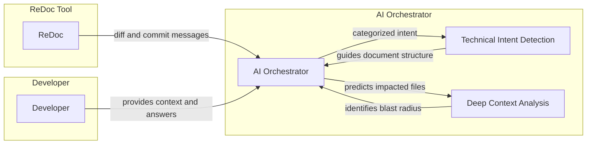

# 🧠 add technical intent detection and deep context impact analysis

> **Brain Dump** | Branch: `main` | 12/23/2025 06:00 PM | 1 commit(s)

**Type:** `FEAT` — The change introduces new functionality to the ReDoc tool, transforming it into an 'AI Documentation Partner' that understands developer intent and the broader impact of code changes.

📝 Commits included

- `2da0503` feat(ai): add technical intent detection and deep context impact analysis

📁 Files changed (5)

- `src/ai/orchestrator.ts`
- `src/ai/types.ts`
- `src/commands/pre-push.ts`
- `src/utils/document.ts`
- `tests/unit/orchestrator.test.ts`

---

## 📊 Architecture / Flow

## 🧠 Brain Dump Summary
The change introduces new functionality to the ReDoc tool, transforming it into an 'AI Documentation Partner' that understands developer intent and the broader impact of code changes. Technical Intent: The developer aimed to align ReDoc with the new 'Agent Mode' requirements. 

## 📁 What Changed
Based on the DIFF, the key technical changes include:
- Updates to `src/ai/orchestrator.ts` to include technical intent detection and deep context impact analysis
- Addition of new types for ChangeIntent and ImpactedFile in `src/ai/types.ts`
- Modifications to `src/commands/pre-push.ts` to handle the new offline mode with default plan settings
- Changes in `src/utils/document.ts` impacted by the updates in the orchestrator and types
- Updates to `tests/unit/orchestrator.test.ts` to reflect the new functionality in the orchestrator

## 💡 Developer's Reasoning
* The goal was to transform ReDoc from a simple diff capture tool into an 'AI Documentation Partner' that understands the developer's intent and the broader impact of code changes.
* The technical intent detection works by categorizing the change (feat, fix, refactor, etc.) based on the diff and commit messages.
* 'Deep Context' uses AI to predict downstream effects of a change, identifying which other files might be impacted even if they aren't in the current git diff.
* Providing a clean JSON interface for questions and answers is crucial for autonomous agents to integrate with CLI tools without fighting interactive TTY constraints.

## 🔗 Deep Context (Predicted Impact)
Based on technical analysis, the areas that might be affected include:
- The files directly changed in the diff
- Any files that use shared types or utilities that were modified
- Downstream effects predicted by the AI based on the change's intent and the project's structure

## 🔮 Future Considerations  
The developer noted the importance of aligning ReDoc with the new 'Agent Mode' requirements and providing a clean JSON interface for autonomous agents. However, no specific next steps or improvements were mentioned.

## 🔗 Deep Context (Predicted Impact)

- **src/ai/orchestrator.ts**: Updated to include technical intent detection and deep context impact analysis
- **src/ai/types.ts**: Added new types for ChangeIntent and ImpactedFile to support the new functionality
- **src/commands/pre-push.ts**: Modified to handle the new offline mode with default plan settings
- **src/utils/document.ts**: Impacted by the changes in the orchestrator and types
- **tests/unit/orchestrator.test.ts**: May need updates to reflect the new functionality in the orchestrator

## 📋 Summary Table

| **ChangeIntent Type** | **Description** | **Example Use Case** |
| --- | --- | --- |
| Feat | New feature implementation | Adding a new API endpoint |
| Fix | Bug fix or correction | Resolving a runtime error |
| Refactor | Code restructuring or optimization | Improving code readability |
| Deep Context | Predicting downstream effects of a change | Identifying impacted files beyond the current diff |

---

💬 Raw Q&A Session

**Q1:** What was the trigger for this change? What problem were you actually solving?

> The goal was to transform ReDoc from a simple diff capture tool into an 'AI Documentation Partner' that understands the developer's intent and the broader impact of code changes, aligning with the new 'Agent Mode' requirements.

**Q2:** How does the technical intent detection work in the orchestrator?

> I updated the orchestrator's planning phase to ask the AI to categorize the change (feat, fix, refactor, etc.) based on the diff and commit messages. This intent then guides the tone and structure of the generated document.

**Q3:** What is 'Deep Context' in this context and why is it useful?

> 'Deep Context' uses AI to predict downstream effects of a change. For example, if a core type is modified, the AI identifies which other files might be impacted even if they aren't in the current git diff. This helps future maintainers understand the blast radius of a change.

**Q4:** What did you learn while implementing the Headless/Agent mode?

> I learned that providing a clean JSON interface for questions and answers is crucial for autonomous agents (like myself) to integrate with CLI tools without fighting interactive TTY constraints.

---

🤖 AI Decisions

- **Technical Intent:** feat (The change introduces new functionality to the ReDoc tool, transforming it into an 'AI Documentation Partner' that understands developer intent and the broader impact of code changes.)
- **Complexity:** detailed
- **Impact analysis:** 5 file(s) identified
- **Generated diagram:** Yes (architecture) - A flowchart or architecture diagram would help illustrate the new 'AI Documentation Partner' functionality and its components
- **Generated table:** Yes (comparison) - A comparison table of the different ChangeIntent types or a table outlining the steps for Deep Context analysis would be beneficial
- **Key insights identified:** The ReDoc tool now understands developer intent and predicts the broader impact of code changes; The 'AI Documentation Partner' functionality is a significant enhancement to the tool; Deep Context analysis helps identify downstream effects of code changes

*Brain dump captured on 12/23/2025, 06:00 PM*
